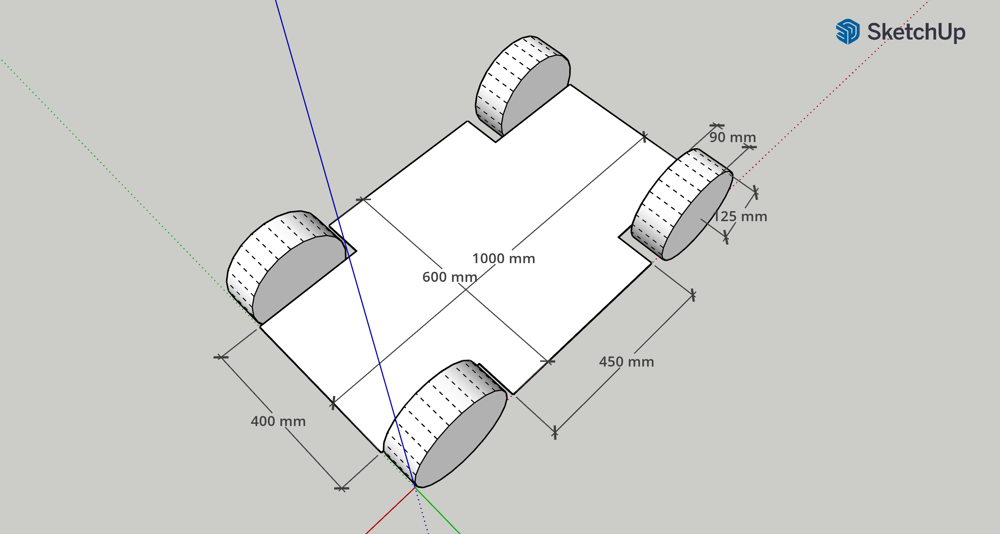
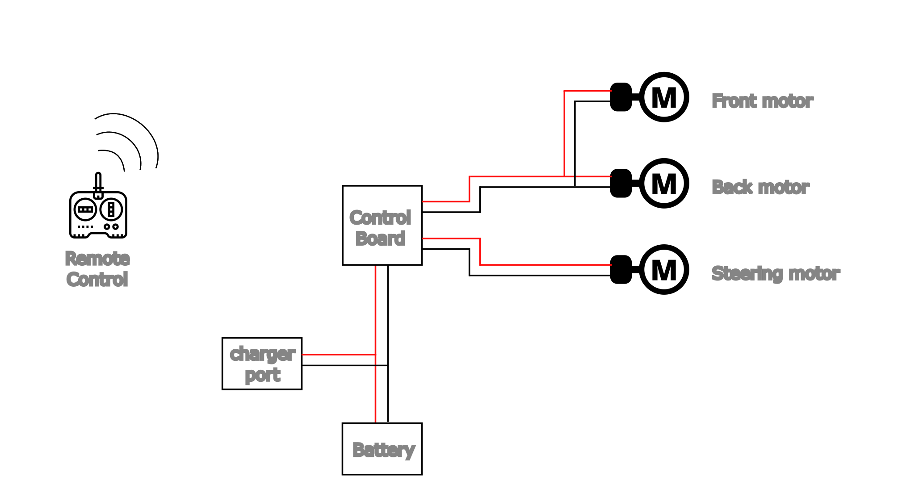
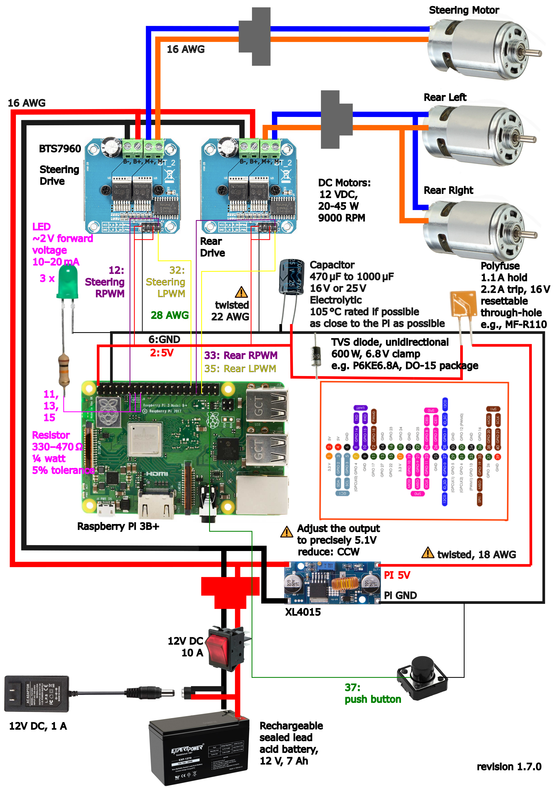
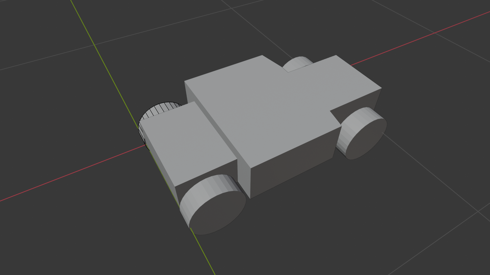
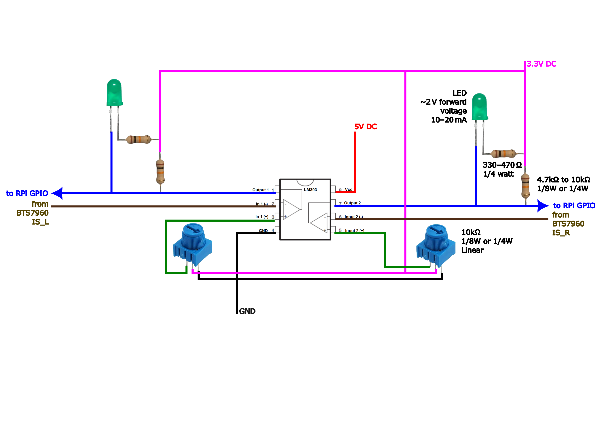

# Bluer Swallow

|   |   |   |
| --- | --- | --- |
|  |  |  |
|  |  |  |
|  |  |  |
|  |  |  |
|  |  |  |
|  |  |  |
|  |  |  |
|  |  |  |
|  |  |  |
|  |  |  |

- [mechanical and analog control](./bluer-swallow-analog.md)
- [digital control](./bluer-swallow-digital.md)
